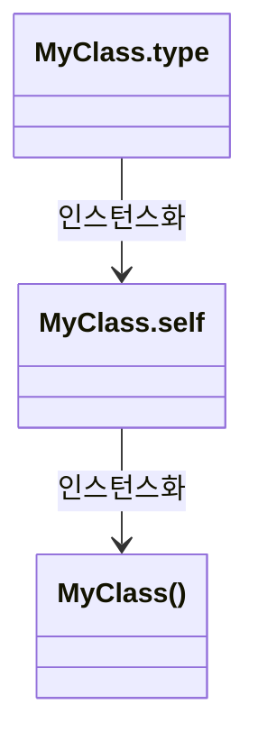

[공식문서](https://docs.swift.org/swift-book/documentation/the-swift-programming-language/types/)

# 타입

## 타입의 종류
### *named type*
`class`, `struct`, `enum`과 같이 소스코드 작성자가 새로히 만들 수 있는 타입입니다.
```swift
class Heap<T: Comparable> { /*...*/ }
```
이 코드에서 작성된 클래스 `Heap`은 *named type*입니다. 그리고 **Swift Standard Library**에 들어간 대다수의 타입들 또한 *named type*입니다.(`Array`, `Dictionary`, `optional values` 또한 *named type*이라는 사실!)

> 다른 프로그래밍 언어에서 사용되는 `Data Type`들(String, Int, Character 등) 또한 Swift에서는 구조체로 만들었기 때문에 *named type*입니다. 그렇기 때문에 `extension`을 사용하여 타입을 커스텀하게 사용할 수 있습니다.

### *compound type*
타입의 명시 없이, Swift에서 사용할 수 있는 타입입니다. 복합 타입에는 두 가지 종류가 있는데, 함수형과 튜플형이 그것들 입니다. *compund type* 내부에는 *named type* 을 넣을 수 있으며, 또 다른 *compound type*을 넣는 것도 가능합니다.

## Type Annotaion
변수나 파라미터 등에 콜론을 통하여 타입을 명시하는 것입니다.
```swift
struct MyStruct { /*...*/ }
let myStruct1 = MyStruct()
let myStruct2: MyStruct = myStruct1
var number: Int = 1
func plus(lhs: Int, rhs: Int) -> Int { /*...*/ }
```

## Type Identifier
*named type*을 나타내거나, `typealias`를 통하여 *named type* 또는 *compound tpye*을 나타낸 것입니다.

`typealias`를 통해 *named type*와 *compound*타입에 별칭을 부여할 수 있습니다. `typealias`는 어디까지 별칭을 부여한 것이기 때문에 별칭인 Identifier를 참조하는 것이 아니라, 별칭 이전의 실체를 참조합니다.
```swift
/*
PhoneNumber가 아닌 실체인 String으로 참조하기 때문에,
[PhoneNumber]는 [String]으로 참조됩니다.
*/
typealias PhoneNumber = String
let numbers = [PhoneNumber]()
```

*nested type*이나 모듈 내에 동일한 이름의 클래스, 구조체 등이 있을 경우, 모듈이나 *nested type*의 타입명부터 명시해야 자신이 원하는 타입을 참조할 수 있습니다.
```swift
// ExampleModule 내에 또 다른 MyClass가 있다고 가정.
import ExampleModule
class MyClass { /* ... */ }
let myClass1 = MyClass()
let myClass2 = ExampleModul.MyClass()
```

## Tuple Type
튜플 타입은 타입들을 콤마로 구분하며, 소괄호로 둘러싸져 있습니다. 모든 튜플은 `Void` 타입을 제외한 두 개 이상의 타입이 들어가야 합니다. 튜플 안의 타입 앞에 `{변수명}:`을 통해서 이름을 부여할 수 있습니다. 이 변수명은 튜플을 이용할 때 생략할 수 있습니다. 그러나 변수명을 바꾸는 것은 불가능합니다. 변수명이 없다면, 왼쪽부터 선언된 타입에 0번부터 인덱스를 부여합니다.
```swift
var point = (y: 5, x: 10)
print("\(point.x) \(point.y)") // 10 5
point.y = 10 // point = (y: 10, x: 10)
point = (11, 11) // point = (y: 11, x: 11)
point = (y: 10, x: 10) // point = (y: 10, x: 10)
point = (col: 10, row: 10) // Error!!!

let temp = ("PI", 3.14, 123)
print(temp.0) // PI
print(temp.1) // 3.14
print(temp.2) // 123
```

## 메타 타입
메타 타입은 클래스, 구조체, 열거형, 프로토콜 등을 포함한 모든 타입의 타입을 보여줍니다.

클래스, 구조체, 열거형은 `.Type`을 통해서 메타 타입을 나타낼 수 있고, 프로토콜은 `.Protocol`을 통해서 메타 타입을 나타낼 수 있습니다.

타입의 뒤에 붙이는 `.self`는 런타임 시 해당 타입의 인스턴스가 아닌 타입 자체를 반환합니다. `type(of:)`를 통해서 해당 인스턴스의 타입 프로퍼티나 타입 메소드에 접근할 수 있습니다.

아래의 예시를 통해서 메타타입 값에서 인스턴스를 생성할 수 있습니다. 해당 타입에는 `final` 키워드가 붙어야하거나 생성자에 `required` 키워드가 붙어야합니다.

> 인스턴스는 타입의 인스턴스이며, 타입은 메타타입의 인스턴스입니다.



```swift
class AnotherSubClass: SomeBaseClass {
    let string: String
    required init(string: String) {
        self.string = string
    }
    override class func printClassName() {
        print("AnotherSubClass")
    }
}
let metatype: AnotherSubClass.Type = AnotherSubClass.self
let anotherInstance = metatype.init(string: "some string")
```

```swift
final class MyClass {
    var num = 0
    init(num: Int = 0) {
        self.num = num
    }
}

func initial(metaType: MyClass.Type) -> MyClass {
    let tSelf = metaType.self
    return tSelf.init(num: 111)
}
```
