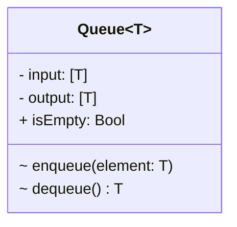
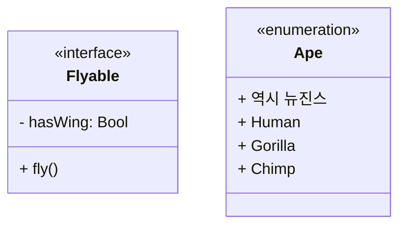
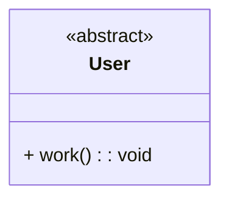

# 뉴준성

날짜: 2023년 9월 27일
작성자: 뉴준성

### UML의 목적에 따른 다양한 사용법

- **개념적 사용법:** 문제 도메인 내 개념과 추상적인 개념을 기술하기 위한 것, 그렇기 때문에 소스코드 간의 관계보단 사람의 자연언어와 더 깊은 연관이 있음. 이로 인해서 의미가 명확하지 않은 개념이 존재할 수 있으며, 해석에 따라 개념의 내용이 달라질 수 있음.
- **명세 & 구현적 사용법:** 소프트웨어 설계 & 완성된 소프트웨어의 구현을 설명하기 위한 것, 소스코드와 관계가 깊다. 그렇기 때문에 일정한 제약과 규칙이 존재하고 이것을 지켜야 함. 모호해지지 않게 형식도 맞춰야 함.

# 클래스 다이어그램

> 클래스 내부의 정적인 내용이나 클래스 사이의 관계를 표기하는 다이어그램.
시스템의 전체 또는 일부를 이것을 통해 나타낼 수 있음.
우리는 클래스 다이어그램을 통해 의존관계를 명확하게 파악할 수 있고,
순환 의존이 발생하는 부분을 찾아서 이를 해결하기 위한 최적의 방법을 고안해낼 수 있음.
> 

## 클래스 다이어그램의 요소

### 클래스

클래스의 이름, 속성, 기능을 표기gka.

또한 속성과 기능에 접근 제한자, 필드명, 함수 타입, 데이터 타입, 매개 변수, 반환 타입을 나타낼 수 있음.

> 접근 지정자의 경우, **+**(public), **-**(private), **#**(protected), **~**(default)로 나타냄
> 



### 스테레오 타입

기본 요소 외의 추가적인 확장요소(ex. protocol, enum 등)를 나타낼 때 씀



### 추상 클래스 / 메서드

추상클래스란 1개 이상의 메서드가 구현체가 없고 명세만 존재하는 클래스를 의미함.

(근데 `Swift`에는 추상클래스가 없다. 왜냐하면 프로토콜로 충분히 구현할 수 있으니까!)



### 클래스 간의 관계

- 일반화
- 실체화
- 의존
- 연관
- 직접연관
- 집합(집합 연관)
- 합성(복합 연관)
- **일반화 관계**
    
    부모와 자식 클래스 간의 상속관계를 표현하고, 화살표가 가르키고 있는 것이 부모 클래스이다.
    
    ```mermaid
    classDiagram
    
    class Singer {
      + name: String
      + sing()
    }
    
    class Idol {
      + members: [members]
      + dance()
      + sing()
    }
    
    class Rapper {
      + rap()
    }
    
    Singer <|-- Idol
    Singer <|-- Rapper
    ```
    
- **실체화 관계**
    
    interface의 spec만 있는 메서드를 오버라이딩 하여 실제 기능으로 구현하는 것을 말한다.
    
    화살표로 가리키는 곳이 인터페이스(ex. protocol)이다.
    
    ```mermaid
    classDiagram
    
    class Flyable {
      - hasWing: Bool
      + fly()
    }
    <<interface>> Flyable
    
    class Plane {
      + payloads: Float
      + ride()
    }
    
    Flyable<|..Plane
    ```
    
- **의존 관계**
    
    어떤 클래스가 다른 클래스를 참조할 때
    
    화살표로 가르키는 곳이 참조당하는 쪽이다.
    
    ```mermaid
    classDiagram
    
    class Factory {
    	- ingredients
    
      + makeRobot() Robot
      + repair(robot: Robot) Robot
    }
    
    class Robot {
      
    }
    
    Robot <.. Factory
    ```
    
- **연관 관계**
    
    보통 다른 객체의 참조를 가지는 필드를 의미함.
    
    ```mermaid
    classDiagram
    
    class Teacher {
      - students: [Student]
      + teach()
    }
    
    class Student {
      + teacher: Teacher
      + study()
    }
    
    Teacher -- Student: 양방향적 의존관계
    
    class Teacher2 {
      - students: [Student2]
      + teach()
    }
    
    class Student2 {
      + study()
    }
    
    class Array
    
    Teacher2 -- "1" Array :students
    Array --> "0..*" Student2
    ```
    
- **집합(집합 연관) 관계**
    
    연관 관계를 특수하게 나타낸 것으로, 전체와 부분으로 나타냅니다.
    
    > 합성(복합 연관) 관계와의 차이점: 합성 관계는 집합관계와 달리 전체를 나타내는 부분이 소멸되면 그 부분들도 소멸되지만, 집합 관계는 전체가 소멸되더라도 부분은 각각의 수명을 가지고 있기 때문에 소멸되지 않아도 됩니다.
    *(마치 올인원 피시와 그냥 컴퓨터의 차이같다고나 할까…?)*
    > 
    
    ```mermaid
    classDiagram
    
    class Computer
    class Monitor
    class Keyboard
    
    Computer o-- Monitor
    Computer o-- Keyboard
    ```
    
- **합성(복합 연관) 관계**
    
    집합 관계와 같이 전체와 부분을 나타내지만, 그 둘 사이에 강력한 결속이 있음.
    
    - 부분의 가지는 전체가 부분의 수명도 책임집니다.
    
    > 전체에 해당되는 인스턴스(이하 ‘전체’)가 부분에 해당되는 인스턴스(이하 ‘부분’)를 생성
    전체가 소멸되면 부분도 소멸
    전체가 복사되면 그 내부의 부분들도 따라서 복사
    > 
    - 부분에 해당되는 각 인스턴스는 공유될 수 없습니다.
    
    ```mermaid
    classDiagram
    
    class AllInOnePC
    class Monitor
    class Keyboard
    
    AllInOnePC *-- Monitor
    AllInOnePC *-- Keyboard
    ```